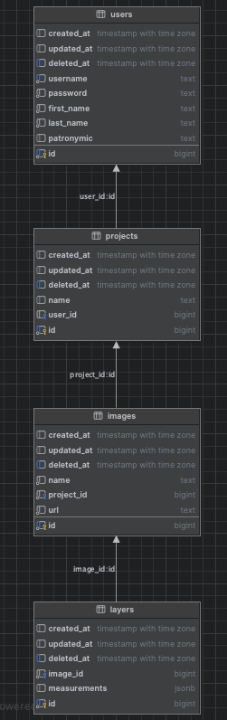

# Thesis Backend

### Инструкция по запуску

1. В `/config` создать файл конфигурации `dev.yaml`
2. Скопировать содержимое `/config/example.yaml` в файл конфигурации `dev.yaml`
3. Запустить `docker-compose` командой `docker-compose up --build -d`
    1. На порту 5432 развернется PostgreSQL
    2. На порту 9001 и 9000 развернется S3 MinIO
       1. После того, как MinIO развернется, перейти по адресу http://localhost:9001
       2. Авторизоваться в админке MinIO (по умолчанию, логин и пароль `minioadmin`)
       3. Создать пустой бакет с названием thesis
       4. В разделе `Access Policy` бакета укзаать `Public`
4. Запустить проект командой `go run cmd/main.go`

### Ссылки при локальной разработке
1. Swagger-документация доступна по адресу http://localhost:8080/swagger/index.html#/
2. Админка MinIO доступна по адресу http://localhost:9001

### ER-диаграмма БД
