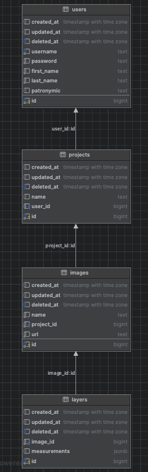

ДИПЛОМ. Back-часть автоматизированной системы для анализа гистологических изображений, основанной на нейросетевой модели CellPose-SAM. Система предназначена для точного измерения размеров клеточных структур, что актуально в условиях роста объёмов медицинских и биологических данных. Решение сочетает высокопроизводительную серверную часть на Go и Python с использованием gRPC для взаимодействия модулей, объектное хранилище MinIO, реляционную СУБД PostgreSQL и кэширование Redis для ускорения обработки. Клиентское приложение реализовано на React и Tauri, обеспечивая низкое потребление ресурсов и кроссплатформенность.

# Thesis Backend

### Инструкция по запуску

1. В `/config` создать файл конфигурации `dev.yaml`
2. Скопировать содержимое `/config/example.yaml` в файл конфигурации `dev.yaml`
3. Запустить `docker-compose` командой `docker-compose up --build -d`
    1. На порту 5432 развернется PostgreSQL
    2. На порту 9001 и 9000 развернется S3 MinIO
       1. После того, как MinIO развернется, перейти по адресу http://localhost:9001
       2. Авторизоваться в админке MinIO (по умолчанию, логин и пароль `minioadmin`)
       3. Создать пустой бакет с названием thesis
       4. В разделе `Access Policy` бакета укзаать `Public`
4. Запустить проект командой `go run cmd/main.go`

### Полезная информация при локальной разработке
1. Swagger-документация доступна по адресу http://localhost:8080/swagger/index.html#/
2. Админка MinIO доступна по адресу http://localhost:9001
3. Креды для подключения к базе данных указаны в конфигурационных файлах (по умолчанию имя пользователя: `thesis`, пароль: `dbpassword123`)
4. Чтобы сгенерировать сваггер, находясь в корне, необходимо написать следующую команду `swag init -g cmd/application/application.go --parseDependency`

### ER-диаграмма БД

